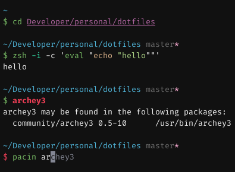

# .dotfiles

<p align="center">
  
</p>

## Installation

Open terminal and navigate to any directory, then type (or paste) following commands:

```shell
$ git clone https://github.com/adampsz/dotfiles && cd dotfiles
$ ./copy.sh
```

After that, you can delete cloned repo.

## Included files

### `.zshrc`

- Based on [`zinit`](https://github.com/zdharma/zinit) plugin manager
- Includes:
  - [`pure`](https://github.com/sindresorhus/pure) prompt, but with classic dollar
  - [`oh-my-zsh`](https://github.com/ohmyzsh/ohmyzsh/) lib (not whole, only those parts that are useful)
  - `oh-my-zsh` plugins:
    `command-not-found`,
    `common-aliases`,
    `git`,
    `sudo` (hit `esc` twice)
  - conditionally loaded plugins, based on environment:
    `archlinux`,
    `debian`,
    `dnf`,
    `suse`,
    `ubuntu`,
    `vscode`,
    `yarn`,
    `yum`
  - [`fast-syntax-highlighting`](https://github.com/zdharma/fast-syntax-highlighting)
  - [`zsh-autosuggestions`](https://github.com/zsh-users/zsh-autosuggestions)
  - [`zsh-completions`](https://github.com/zsh-users/zsh-completions)
  - [`history-search-multi-word`](https://github.com/zdharma/history-search-multi-word) (hit `ctrl+R`)
  - and others:
    [`undollar`](https://github.com/zpm-zsh/undollar),
    [`colorize`](https://github.com/zpm-zsh/colorize),
    [`zsh-autopair`](https://github.com/hlissner/zsh-autopair),
    [`zsh-you-should-use`](https://github.com/MichaelAquilina/zsh-you-should-use),
- Starts under **70ms** (!) on my (not so good) machine
